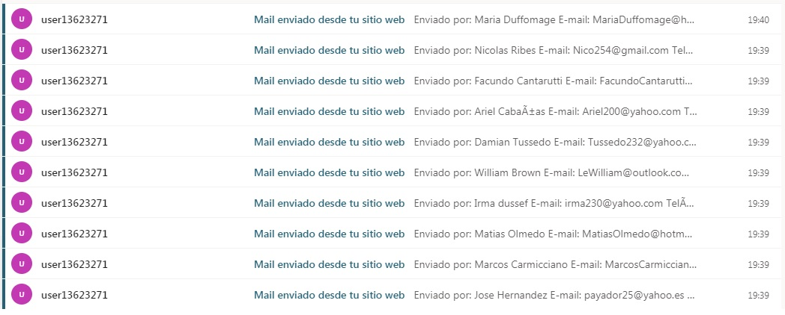
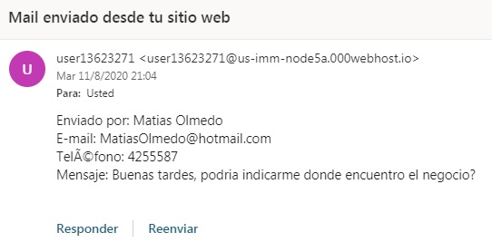
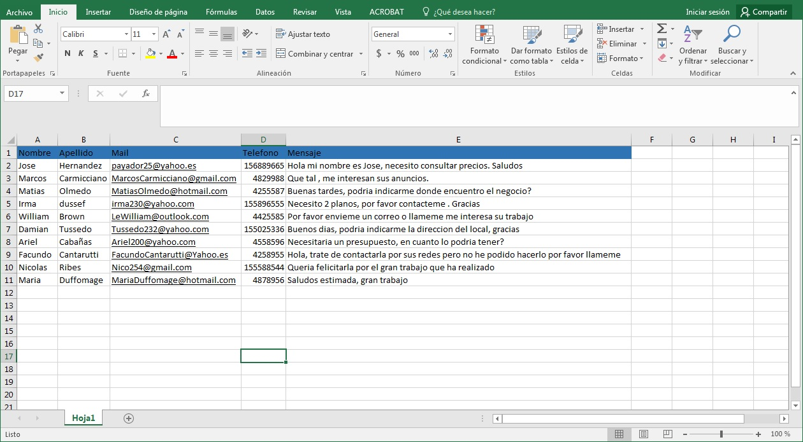

# Modulo-envio-formulario-web-automaticamente

La pagina Web donde se hace este envío automático de formulario es una pagina de prueba desarrollada por mi (La pueden encontrar en mis repositorios como Sitio-Web-interiorismo) y 
los datos que se envían son inventados, no corresponden a personas reales.

Este modulo funciona tomando los datos desde un archivo Excel(utilizando la librería POI para manipularlos) que se encuentra en la carpeta del programa, con los datos que necesita 
el formulario Web , en este caso es el nombre, apellido, mail, telefono y el mensaje que queremos que ingrese, el modulo toma todos estos datos, se conecta a la pagina Web donde 
esta el formulario, los ingresa en los distintos campos y lo envía simulando ser un usuario(para hacer esto usamos la librería Htmlunit) , como en nuestra planilla de Excel hay 10 usuarios con todos los datos correspondientes, se envían 10 mails distintos.

El formulario esta programado para que los datos enviados a traves de este se envíen a un mail para ser leídos, con la llegada de los mails podemos comprobar el correcto funcionamiento del modulo de automatización para el llenado y envío de formularios.

Acá dejo el link de la pagina donde se encuentra el formulario: https://interiorismonallin.000webhostapp.com/contacto.html 

Para ser ejecutado el programa necesitaremos un IDE(se ha usado netbeans para desarrollarlo) , ya que no cuenta con una ejecutable.

Adjunto una captura de la llegada de los mails correctamente, un ejemplo de uno de los mails que se recibió y el Excel que estamos utilizando para enviar dichos datos.

